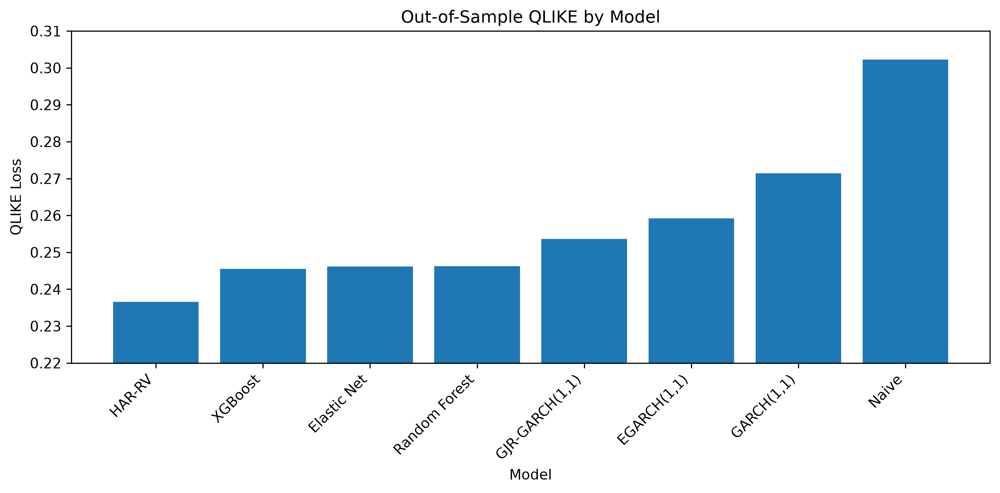
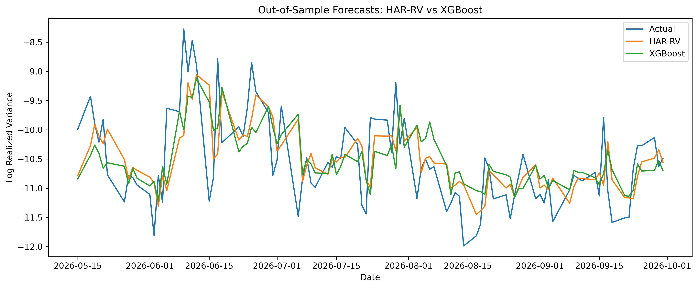

# SPY Realized Volatility Forecasting

A Python project comparing traditional volatility models and machine-learning methods for one-day-ahead SPY realized volatility forecasting.

The main question was simple:

**Do more complex machine-learning models improve volatility forecasts compared with a relatively simple HAR-RV model?**

The answer in this sample was: **not really**.

HAR-RV produced the best out-of-sample results across all three evaluation metrics, although the differences against the other forecasting models were generally not statistically significant.

---

## Data

The project uses 5-minute SPY market data from:

**3-October-2024 – 30-September-2026**

The raw data were retrieved through the Massive API.

Only regular U.S. trading hours were used:

**09:30–16:00 ET**

Daily realized variance was calculated from 5-minute log returns:

$$
RV_t = \sum_{i=1}^{M} r_{t,i}^2
$$

where $r_{t,i}$ is the i-th 5-minute log return on day $t$, and $M$ is the number of intraday returns.

Early-close trading days were removed so that each daily realized variance observation is based on the same 6.5-hour trading window.

The final realized-volatility dataset contains **494 full trading days**.

Raw intraday data are not included in the repository.

---

## Volatility characteristics

Before fitting the forecasting models, the basic properties of the realized-volatility series was looked at.

The data show typical volatility behavior:

- realized variance is strongly right-skewed
- the log transformation makes the distribution considerably more symmetric
- volatility clusters over time
- autocorrelation remains positive over several trading-day horizons

For log realized variance, the autocorrelations at selected lags were:

| Lag     | Autocorrelation |
|:--------|----------------:|
| 1 day   |           0.687 |
| 5 days  |           0.401 |
| 22 days |           0.189 |

This persistence provides the motivation for the daily, weekly and monthly components used in HAR-RV.

---

## Models

I compared eight forecasting approaches:

- Naive persistence benchmark
- HAR-RV
- GARCH(1,1)
- GJR-GARCH(1,1)
- EGARCH(1,1)
- Elastic Net
- Random Forest
- XGBoost

### Machine-learning features

The ML models use information available at the end of day $$t$$ to forecast realized variance on day $$t+1$$.

Features include:

- daily realized variance
- 5-day average realized variance
- 22-day average realized variance
- daily return
- absolute return
- negative-return indicator
- intraday high-low range
- trading volume
- 5-day average absolute return
- 5-day average high-low range
- 5-day average log volume

Hyperparameters were selected using **TimeSeriesSplit**, so the temporal ordering of the data is preserved during cross-validation.

---

## Out-of-sample evaluation

All models are evaluated on the same final **95 trading days**.

The metrics are:

- **MAE** — calculated on log realized variance
- **RMSE** — calculated on log realized variance
- **QLIKE** — calculated on the realized variance scale

Lower values are better.

| Model            |      MAE |     RMSE |    QLIKE |
|:-----------------|---------:|---------:|---------:|
| **HAR-RV**       | **0.4741** | **0.6430** | **0.2367** |
| XGBoost          |   0.5331 |   0.6650 |   0.2450 |
| Elastic Net      |   0.5178 |   0.6448 |   0.2461 |
| Random Forest    |   0.5305 |   0.6733 |   0.2514 |
| GJR-GARCH(1,1)   |   0.6902 |   0.8070 |   0.2532 |
| EGARCH(1,1)      |   0.6933 |   0.8273 |   0.2591 |
| GARCH(1,1)       |   0.7039 |   0.8173 |   0.2710 |
| Naive            |   0.5337 |   0.7231 |   0.3022 |

HAR-RV improved on the naive benchmark by approximately:

- **11.2% in MAE**
- **11.1% in RMSE**
- **21.7% in QLIKE**

---

## Model comparison



HAR-RV achieved the lowest QLIKE loss.

XGBoost and Elastic Net are relatively close, while the GARCH-related models performed better than the naive benchmark according to QLIKE but worse according to MAE and RMSE.

This difference is useful to keep in mind because the metrics evaluate forecasts on different scales.

---

## Forecasts



Both HAR-RV and XGBoost follow the general volatility level reasonably well.

The forecasts are noticeably smoother than the realized series, especially around sudden volatility spikes. This is one of the clearest limitations visible in the out-of-sample period.

---

## Asymmetric volatility

The GJR-GARCH and EGARCH results also showed evidence of asymmetric volatility responses.

In both models, negative return shocks were associated with larger subsequent volatility effects than comparable positive shocks.

A similar pattern appeared in the XGBoost interpretation.

---

## XGBoost interpretation

I used SHAP values to examine what the XGBoost model was using in its forecasts.

The most influential variables were:

1. 5-day average high-low range
2. daily realized variance
3. daily return
4. 5-day average absolute return
5. weekly realized variance

One interesting result was the behavior of daily returns: negative returns tended to increase the model's next-day volatility forecast, while positive returns tended to decrease it.

This is consistent with the asymmetric behavior found in the GJR-GARCH and EGARCH models.

---

## Forecast accuracy tests

HAR-RV had the lowest QLIKE loss against every competing model.

However, the forecast-loss differences against the econometric and machine-learning models were **not statistically significant** over the 95-day test period.

The comparison against the naive benchmark was very close to the conventional 5% significance level:

p = 0.050007

The result should be interpreted as HAR-RV being **best in this sample**, rather than as strong evidence that it is universally superior to the other models.

---

## Project structure

```
volatility-forecasting/
│
├── data/
│   ├── raw/
│   └── spy_daily_realized_volatility.csv
│
├── figures/
│   ├── model_qlike_comparison.png
│   └── har_vs_xgboost_forecasts.png
│
├── notebooks/
│   ├── 01_data_preparation.ipynb
│   ├── 02_volatility_analysis.ipynb
│   ├── 03_har_rv_model.ipynb
│   ├── 04_garch_models.ipynb
│   ├── 05_machine_learning.ipynb
│   └── 06_model_comparison.ipynb
│
├── results/
├── .gitignore
├── README.md
└── requirements.txt
```

---

## Tools

Python
pandas
NumPy
matplotlib
statsmodels
scikit-learn
arch
XGBoost
SHAP

---

## Installation

pip install -r requirements.txt

---

## Conclusion

The main takeaway from this project is that additional model complexity did not automatically lead to better volatility forecasts.

HAR-RV was the strongest model in this sample despite being considerably simpler than the tree-based machine learning approaches. XGBoost captured useful nonlinear relationships and provided interesting information about the drivers of future volatility, but it did not improve the overall out-of-sample forecast accuracy.

The most interesting part of the project was seeing the same volatility characteristics appear through different modelling approaches: persistence in HAR-RV, asymmetric shocks in GARCH models, and similar patterns in the SHAP analysis of XGBoost.

A natural next step would be to repeat the analysis over a longer sample and across multiple assets or market regimes.